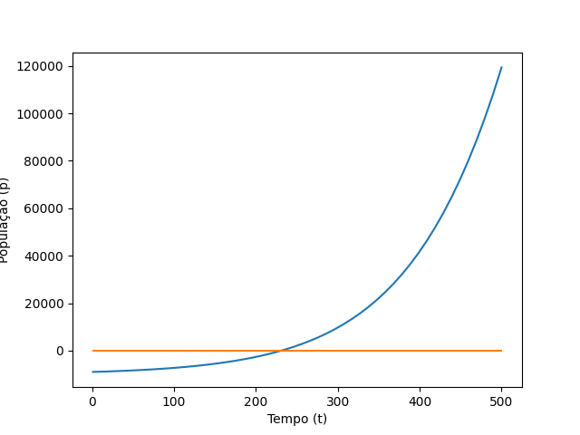

# Métodos Numéricos para Equações Não-Lineares

Este repositório contém implementações em Python de métodos numéricos para encontrar raízes de equações não-lineares, como o método da bisseção e o
método de Newton-Raphson. Além disso, inclui uma aplicação desses métodos para resolver um problema específico de modelagem populacional em Marte.

## Descrição dos Arquivos

- `crescimento-pop-em-marte.py`: Contém as implementações dos métodos da bisseção e de Newton-Raphson, juntamente com uma função para modelar o crescimento populacional em Marte dadas algumas hipóteses.
- `README.md`: Este arquivo que você está lendo agora, fornecendo uma visão geral do projeto e instruções de uso.

## Funcionalidades

- **Modelagem Populacional**: A função `eq_population` modela o crescimento populacional com base em uma equação logística.
- **Método da Bisseção**: Implementação do método da bisseção para encontrar raízes de equações não-lineares.
- **Método de Newton-Raphson**: Implementação do método de Newton-Raphson para encontrar raízes de equações não-lineares.

## Uso

1. Certifique-se de ter o Python e as bibliotecas necessárias instaladas (SymPy, NumPy, Matplotlib, PrettyTable).
2. Execute o arquivo `crescimento-pop-em-marte.py`.
3. Caso queira, modifique o código e utilize uma outra equação que resolve outra incógnita para encontrar a raiz de uma variável escolhida.

## Modelagem populacional em Marte
A determinação dos valores iniciais que foram passados como parâmetro da função de modelagem populacional, bem como a escolha dessa função em específico,
foram escolhidos após horas de estudo prévio, culminando
na admissão de algumas hipóteses. Entretanto, por se tratar de um tema de estudo (sobrevivência fora da Terra) que não possui um consenso geral na grande maioria dos tópicos 
entre os cientistas, o modelo está sujeito a erros e não pode ser considerado uma fonte confiável de estimativa.
```python
# Exemplo de uso da função para modelagem populacional e métodos de resolução de equações não-lineares
capac, popi, taxa, popt = 1000000, 1000, 0.01, 10000
fs, fn = eq_population(capac, popi, taxa, popt)
t = np.linspace(1, 500)
plt.plot(t, fn(t), t, 0*t)
plt.show()
bissecao(str(fs), 200, 300, 1e-5, 25)
newton(200, str(fs), str(df), 1e-5, 30)
```
## Gráfico plotado
O gráfico plotado serve para descobrirmos em que intervalo está a nossa raiz e utilizarmos em nosso método numérico. Pelo gráfico, podemos perceber que se encontra entre 200 e 300.

